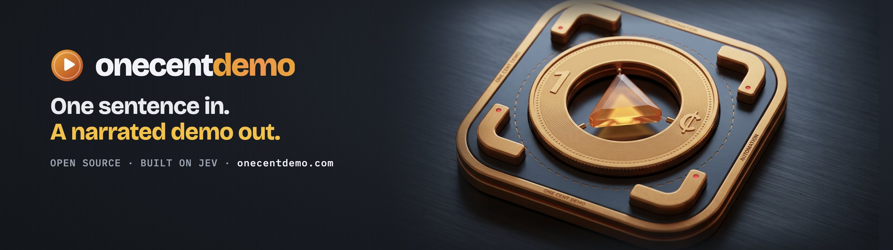
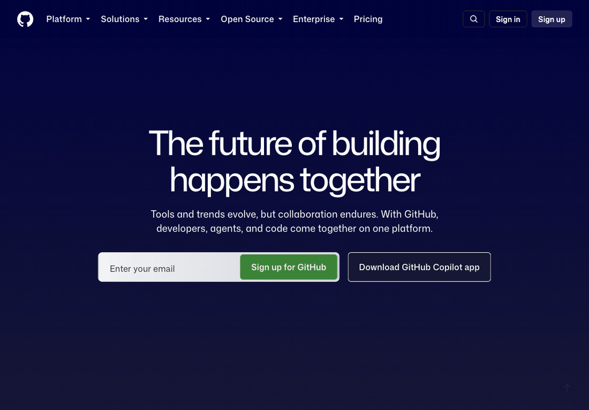

# jev-demofast

[](https://onecentdemo.com)

**One sentence in, a product demo video out.** jev-demofast drives your real product in a browser, outlines every
element it uses, and renders an MP4 or GIF, optionally narrated by a human-sounding voice. The step-by-step decisions
are made by [Jev](https://typesafe.ai/blog/introducing-system-one-models-and-jev), a fast "System One" decision
model. On your own app, Jev is guided by a map of every screen built from your source code.

**See it run:** [onecentdemo.com](https://onecentdemo.com) replays two real runs, decision by decision, then plays the
narrated videos they produced. **Read the story:** [Jev couldn't find the password reset form. Then we gave it a
map.](https://www.linkedin.com/pulse/jev-couldnt-find-password-reset-form-we-gave-map-venkat-podugu-p23fe/)



```
jev-demofast demo "Show how to find hot trending open-source projects on GitHub this week, then open one and show
which signals help you tell a genuine project from spam" --url https://github.com/ --gif
```

That GIF is the unedited output, about 20 seconds from sentence to video. Jev opened the hidden *Date range* menu to
find "This week" on its own.

## Why

Hand-recorded demos go stale with every UI change, and every demo tool we could find starts with a person recording
clicks. jev-demofast starts from a sentence, so re-recording after a release is one command.

## Quickstart

**You need:**
- Python 3.12+, [uv](https://docs.astral.sh/uv/), ffmpeg and Google Chrome
- a Cloudflare account with Workers AI

Jev runs on Cloudflare as `typesafe/jev` and is paid from **AI Gateway credits**: add a few dollars in the dashboard
(AI → AI Gateway → Credits). A demo costs cents.

```bash
git clone https://github.com/q3learners/jev-demofast && cd jev-demofast
uv sync
export CLOUDFLARE_ACCOUNT_ID=...   CLOUDFLARE_API_TOKEN=...          # a token with Workers AI access

uv run jev-demofast chrome          # an isolated Chrome profile; your own browser and logins are untouched
uv run jev-demofast demo "Show how to find hot trending projects on GitHub this week" \
    --url https://github.com/ --gif --out github.mp4
```

**Your own app, with a map built from source (Next.js app router):**

```bash
uv run jev-demofast index ../my-nextjs-app --out app-index.json      # ~1 s for 190 routes
DEMO_PASSWORD='...' uv run jev-demofast demo "Reset my password for test@example.com" \
    --url https://staging.example.com --index app-index.json --fresh --out reset.mp4
```

With an index, **Jev drives on its own**; no LLM plans the route. Without one, an LLM plans the route once and Jev
handles every step that needs judgment.

**Narrated:** add `--voice apollo` (or a female voice such as `thalia`) for a Deepgram Aura-2 voice (about $0.03 per
1,000 characters), with or without `--index`. `--voice-speed 1.2` speaks faster at the same pitch. The script is written from what was actually on screen and kept short (about 11 words per step), and on
runs without an index the camera pans to whatever each line talks about. Add `--music track.mp3` for a background
bed: it plays alone for 2 s before the narrator starts and after they finish, loops to the video's length, and
dips gently whenever the narrator speaks (the voice is also softened to sit inside it). Use a track
you have the rights to (Pixabay Music and the YouTube Audio Library allow commercial use).

Use **staging and test accounts**. The tool clicks real buttons and submits real forms. To see the route first,
add `--dry-run`: the run stops before the first action that changes data (a submit, save, invite or toggle) and
the video ends on that element, labelled "would click".

"Create a demo of how to X" and "Show me how to X" are treated as X. Every run also writes `replay.json`: each
Jev question with its options, probabilities and timing, plus a timestamped log, so you can see why it clicked what
it clicked.

## Logins

There are three ways to get past a login, safest first:

1. **Log in once in the tool's own Chrome (recommended).**
   ```bash
   uv run jev-demofast chrome --open https://staging.example.com/login
   ```
   You log in by hand, so SSO, "Sign in with Google" and two-factor codes all work. The tool's profile
   (`~/.cache/jev-demofast/chrome-profile`) remembers the session, so later demos start logged in. Don't pass
   `--fresh`: it clears that site's cookies.
2. **Let the tool type the credentials:** put `{{PASSWORD}}` in the prompt and set `DEMO_PASSWORD`. The value is
   typed straight into the password field; no model or log ever sees it.
3. **Your own everyday Chrome (opt-in):** `--use-my-browser`.
   - You switch on remote debugging in `chrome://inspect/#remote-debugging`, and Chrome asks you to allow the
     connection.
   - The tool asks you to confirm (`--yes` skips this, for scripts). It refuses `--fresh`, so it can never log you
     out, and it works in a new tab without touching your other tabs.
   - It acts **as you**, under your real logins, often on production. The guards still apply, but mistakes are
     real. Use it knowingly.

## How it works

| Stage | What happens | Who decides |
|---|---|---|
| Map (optional) | Routes, links (label → destination), fields, buttons, text and data-changing forms, parsed from source with tree-sitter | code |
| Plan | Without a map: a rough route, written once ("Open Source → Trending → This week → a repo") | LLM |
| Drive | Each step: which element matches, which menu hides a target, whether the form is here, whether it's done | **Jev** |
| Check | Stays on the site; never signs up, logs out or deletes; undoes a click that led nowhere; waits for the page to settle before verifying | code |
| Record | Outlined frames; typed values blurred; secrets typed from `{{NAME}}` placeholders and never shown to a model | code |
| Render | MP4 and GIF, with an optional script, voice and camera that follows the narration | ffmpeg (+ LLM, TTS) |

Details and the experiments behind each rule are in [docs/how-it-works.md](docs/how-it-works.md).

## Measured (September 2026)

- **GitHub, a site it was never tuned for:** 5 of 5 runs verified, **14.4–28.2 s** from sentence to recording; one
  slower run took 44.2 s because a single LLM page read took 30 s. Jev's own decisions take about 0.25 s each.
- **Jev + app index on [nextjs/saas-starter](https://github.com/nextjs/saas-starter):** sign in, then invite a
  teammate as a member, with no LLM route plan. 5 of 5 runs, **8.3–17.1 s** from sentence to video, with the
  invitation confirmed in the database. Reproduce it: `examples/saas-starter-invite.sh`.
- **Jev + app index, a password reset three screens from a marketing home page (a private Next.js app):** 2 of 2 in
  10.8–15.0 s. Without the map, Jev gave up at step 1.
- **Narrated:** script, voice and render add 10–16 s. Sentence to narrated video: **18.3 s** for the saas-starter
  invite (a 27 s video), **30.6 s** for the GitHub demo (35 s).
- **Synonyms:** the plan said "Sign in" where the site said "Log in", and "Account recovery" where it said
  "Forgot password?". Jev matched them at 0.96–0.99; keyword matching alone got stuck.

## Configuration

| Variable | Default | Purpose |
|---|---|---|
| `CLOUDFLARE_ACCOUNT_ID`, `CLOUDFLARE_API_TOKEN` | — | required |
| `JEV_TOKEN` | the API token | a separate token for Jev calls |
| `BU_CDP_URL` | `http://127.0.0.1:9333` | the Chrome to drive (`jev-demofast chrome` starts one) |
| `JDF_PLAN_MODEL` / `JDF_PLAN_EXTRA` | `@cf/zai-org/glm-5.3-flash` / `{"reasoning_effort":"low"}` | route plans |
| `JDF_READ_MODEL` | `@cf/meta/llama-3.3-70b-instruct-fp8-fast` | reading page text and form values |
| `JDF_SCRIPT_MODEL` / `JDF_SCRIPT_EXTRA` | GLM-5.3-flash, reasoning low | the narration script |
| `JDF_TTS_MODEL`, `JDF_EMBED_MODEL`, `JDF_JEV_MODEL` | Aura-2 en, bge-base, `typesafe/jev` | voice, camera-follow, decisions |
| `DEMO_<NAME>` | — | values for `{{NAME}}` placeholders in prompts |

browser-harness telemetry and update checks are off by default (`BH_TELEMETRY=0`, `BH_UPDATE_CHECK=0`).

## Limits

- The app index reads **Next.js app router** projects today. Other frameworks need an adapter that returns the same
  shape (see `src/jev_demofast/index/__init__.py`). Without an index, any site still works through the LLM plan.
- Jev's "done" judgment is borderline (about 0.5 after the page settles). That's enough to stop a demo, but not to
  pass or fail a test.
- Blind spots inherited from the browser layer: iframes, shadow DOM, file uploads, pop-up windows, and nested scroll
  areas. Sites protected by captchas will block it.
- Jev is a paid, closed model. The decision layer is small (`cloudflare.py`), so other backends can be added.

## Roadmap

- **Tests from the same sentence:** explicit expectations, a replay mode, and CI exit codes, so one spec gives you
  a demo and a test.
- Index adapters for React Router, Remix, Rails and Django.
- Waiting on page readiness instead of fixed pauses, and click-through HTML tours from the same recordings.

## Contributing

Contributions are welcome, especially index readers for more frameworks (React Router, Remix, Rails, Django),
waiting on page readiness instead of fixed pauses, and tests from the same sentence. Start with the
[good first issues](https://github.com/q3learners/jev-demofast/labels/good%20first%20issue) and read
[CONTRIBUTING.md](CONTRIBUTING.md) for setup (the tests run offline) and guidelines.

## Credits

Built on [browser-use/jev-ultrafast](https://github.com/browser-use/jev-ultrafast) and
[laya-ultrafast](https://github.com/ipenywis/laya-ultrafast) (MIT, Browser Use; see `NOTICE`),
[browser-harness](https://pypi.org/project/browser-harness/) (MIT), and Jev by [TypeSafe](https://typesafe.ai),
used through Cloudflare Workers AI. Not affiliated with TypeSafe or Browser Use.

MIT License.
